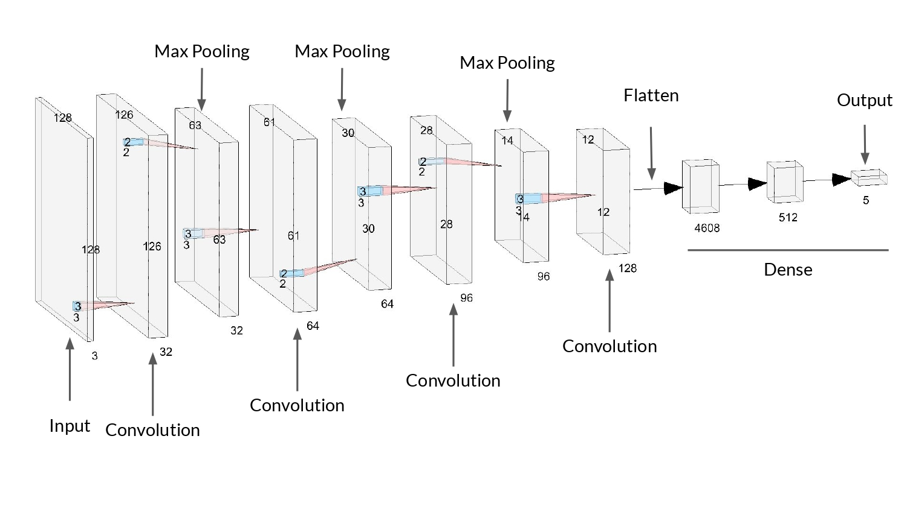

# NarutoNet

The objective of this repository is to propose a neural network architecture capable of classifying images of different characters from the Naruto anime. Another contribution of this project is to propose a labelled dataset to train the models in a supervised way.

  

  figure: NarutoNet architecture (i.e. a customised AlexNet)

